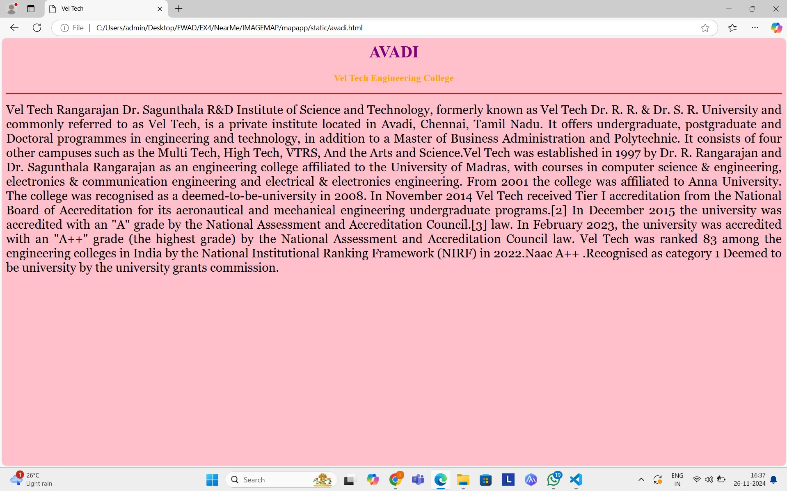
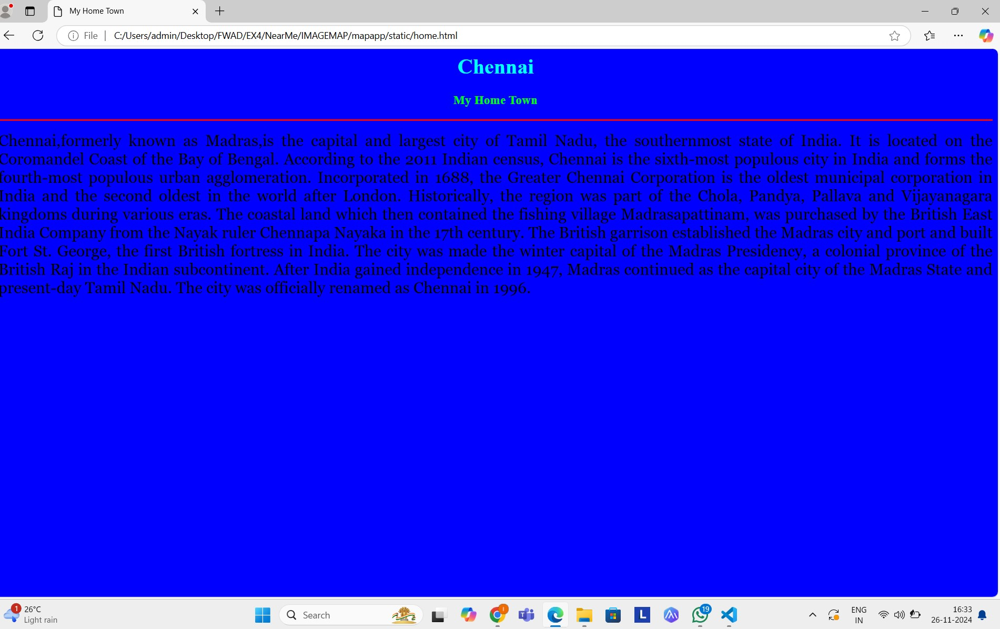
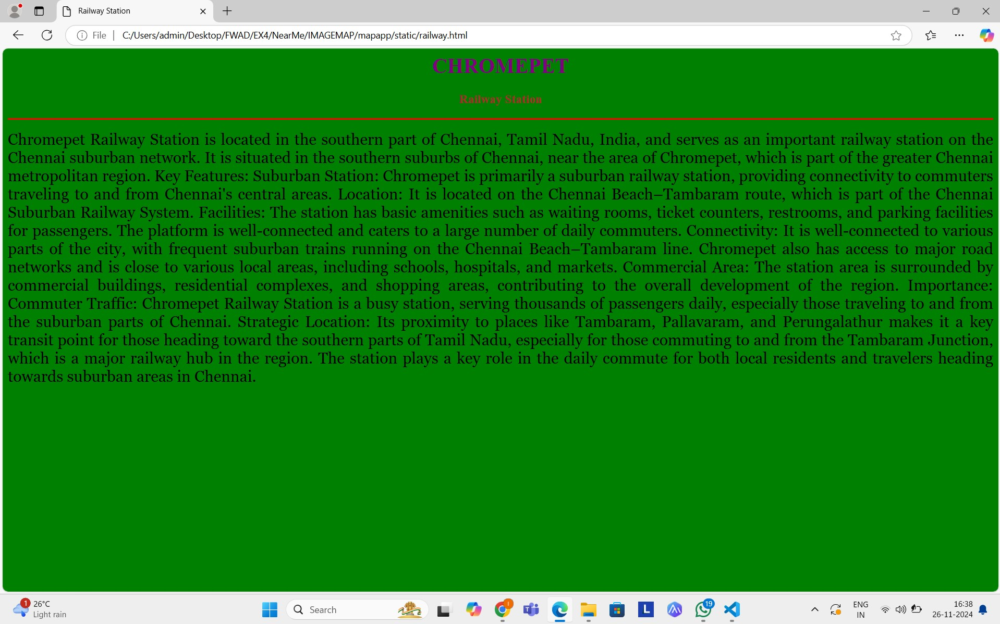
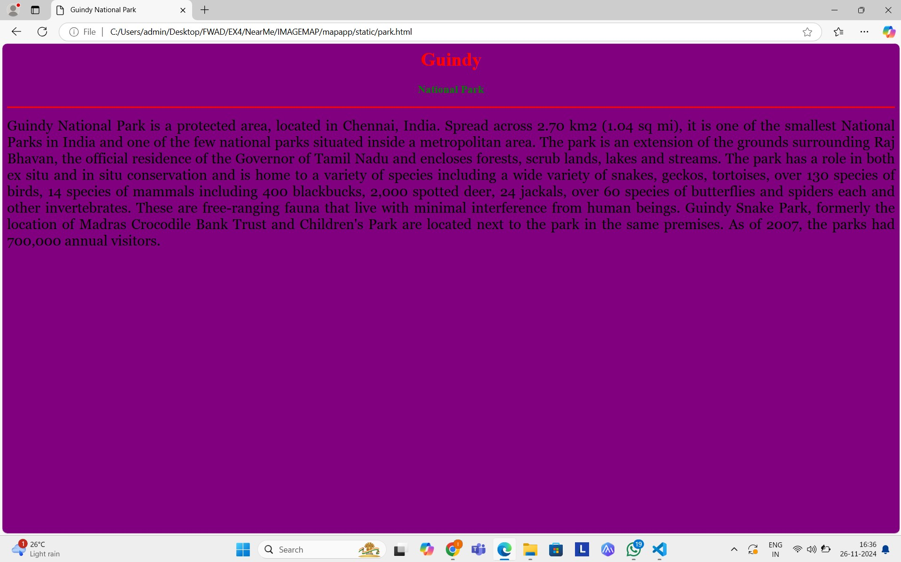
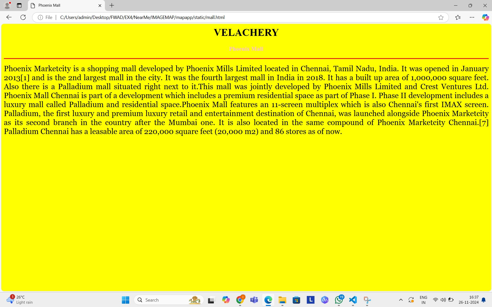

# Ex04 Places Around Me
## Date: 26.11.24

## AIM
To develop a website to display details about the places around my house.

## DESIGN STEPS

### STEP 1
Create a Django admin interface.

### STEP 2
Download your city map from Google.

### STEP 3
Using ```<map>``` tag name the map.

### STEP 4
Create clickable regions in the image using ```<area>``` tag.

### STEP 5
Write HTML programs for all the regions identified.

### STEP 6
Execute the programs and publish them.

## CODE
map.html
```
<html>
    <head>
        <title>My Home Town</title>
        </head>
        <body bgcolor="blue">
        <h1 align="center">
        <font color="cyan"><b>CHENNAI</b></font>
        </h1>
        <h3 align="center">
        <font color="lime"><b>My Home Town</b></font>
        </h3>
        <hr size="3" color="red">
        <p align="justify">
        <font face="Georgia" size="5">
            Chennai,formerly known as Madras,is the capital and largest city of Tamil Nadu, the southernmost state of India.
             It is located on the Coromandel Coast of the Bay of Bengal. According to the 2011 Indian census, 
             Chennai is the sixth-most populous city in India and forms the fourth-most populous urban agglomeration. 
             Incorporated in 1688, the Greater Chennai Corporation is the oldest municipal corporation in India 
             and the second oldest in the world after London. Historically, the region was part of 
             the Chola, Pandya, Pallava and Vijayanagara kingdoms during various eras. 
             The coastal land which then contained the fishing village Madrasapattinam, was purchased by the British East India Company 
             from the Nayak ruler Chennapa Nayaka in the 17th century. The British garrison established the Madras city and port 
             and built Fort St. George, the first British fortress in India. The city was made the winter capital of the Madras Presidency, 
             a colonial province of the British Raj in the Indian subcontinent. After India gained independence in 1947,
             Madras continued as the capital city of the Madras State and present-day Tamil Nadu. 
             The city was officially renamed as Chennai in 1996.
        </font>
        </p>
    </body>
</html>
```
home.html
```
<html>
    <head>
        <title>My Home Town</title>
        </head>
        <body bgcolor="blue">
        <h1 align="center">
        <font color="cyan"><b>CHENNAI</b></font>
        </h1>
        <h3 align="center">
        <font color="lime"><b>My Home Town</b></font>
        </h3>
        <hr size="3" color="red">
        <p align="justify">
        <font face="Georgia" size="5">
            Chennai,formerly known as Madras,is the capital and largest city of Tamil Nadu, the southernmost state of India.
             It is located on the Coromandel Coast of the Bay of Bengal. According to the 2011 Indian census, 
             Chennai is the sixth-most populous city in India and forms the fourth-most populous urban agglomeration. 
             Incorporated in 1688, the Greater Chennai Corporation is the oldest municipal corporation in India 
             and the second oldest in the world after London. Historically, the region was part of 
             the Chola, Pandya, Pallava and Vijayanagara kingdoms during various eras. 
             The coastal land which then contained the fishing village Madrasapattinam, was purchased by the British East India Company 
             from the Nayak ruler Chennapa Nayaka in the 17th century. The British garrison established the Madras city and port 
             and built Fort St. George, the first British fortress in India. The city was made the winter capital of the Madras Presidency, 
             a colonial province of the British Raj in the Indian subcontinent. After India gained independence in 1947,
             Madras continued as the capital city of the Madras State and present-day Tamil Nadu. 
             The city was officially renamed as Chennai in 1996.
        </font>
        </p>
    </body>
</html>
```
avadi.html
```
<html>
    <head>
        <title>Vel Tech</title>
        </head>
        <body bgcolor="pink">
        <h1 align="center">
        <font color="purple"><b>AVADI</b></font>
        </h1>
        <h3 align="center">
        <font color="orange"><b>Vel Tech Engineering College</b></font>
        </h3>
        <hr size="3" color="red">
        <p align="justify">
        <font face="Georgia" size="5">
            Vel Tech Rangarajan Dr. Sagunthala R&D Institute of Science and Technology, formerly
            known as Vel Tech Dr. R. R. & Dr. S. R. University and commonly referred to as Vel Tech,
            is a private institute located in Avadi, Chennai, Tamil Nadu. It offers undergraduate, 
            postgraduate and Doctoral programmes in engineering and technology, in addition to a Master
            of Business Administration and Polytechnic. It consists of four other campuses such as 
            the Multi Tech, High Tech, VTRS, And the Arts and Science.Vel Tech was established in 1997 
            by Dr. R. Rangarajan and Dr. Sagunthala Rangarajan as an engineering college affiliated  
            to the University of Madras, with courses in computer science & engineering, electronics & 
           communication engineering and electrical & electronics engineering. From 2001 the college was
           affiliated to Anna University. The college was recognised as a deemed-to-be-university in 2008.
           In November 2014 Vel Tech received Tier I accreditation from the National Board of Accreditation for its
           aeronautical and mechanical engineering undergraduate programs.[2] In December 2015 the university was accredited 
           with an "A" grade by the National Assessment and Accreditation Council.[3] law. In February 2023, the university
           was accredited with an "A++" grade (the highest grade) by the National Assessment and Accreditation Council law.
           Vel Tech was ranked 83 among the engineering colleges in India by the National Institutional Ranking Framework (NIRF)
           in 2022.Naac A++ .Recognised as category 1 Deemed to be university by the university grants commission.
        </font>
        </p>
    </body>
</html>
```
mall.html
```
<html>
    <head>
        <title>Phoenix Mall</title>
        </head>
        <body bgcolor="yellow">
        <h1 align="center">
        <font color=""><b>VELACHERY</b></font>
        </h1>
        <h3 align="center">
        <font color="pink"><b>Phoenix Mall</b></font>
        </h3>
        <hr size="3" color="red">
        <p align="justify">
        <font face="Georgia" size="5">
            Phoenix Marketcity is a shopping mall developed by Phoenix Mills Limited located in Chennai,
            Tamil Nadu, India. It was opened in January 2013[1] and is the 2nd largest mall in the city. 
            It was the fourth largest mall in India in 2018. It has a built up area of 1,000,000 square feet. 
            Also there is a Palladium mall situated right next to it.This mall was jointly developed by Phoenix Mills 
            Limited and Crest Ventures Ltd. Phoenix Mall Chennai is part of a development which includes
            a premium residential space as part of Phase I. Phase II development includes a luxury mall 
            called Palladium and residential space.Phoenix Mall features an 11-screen multiplex which
            is also Chennai's first IMAX screen. Palladium, the first luxury and premium luxury retail and 
            entertainment destination of Chennai, was launched alongside Phoenix Marketcity as its second
            branch in the country after the Mumbai one. It is also located in the same compound of Phoenix
            Marketcity Chennai.[7] Palladium Chennai has a leasable area of 220,000 square feet (20,000 m2)
            and 86 stores as of now.
        </font>
        </p>
    </body>
</html>
```
park.html
```
<html>
    <head>
        <title>Guindy National Park</title>
        </head>
        <body bgcolor="purple">
        <h1 align="center">
        <font color="red"><b>GUINDY</b></font>
        </h1>
        <h3 align="center">
        <font color="green"><b>National Park</b></font>
        </h3>
        <hr size="3" color="red">
        <p align="justify">
        <font face="Georgia" size="5">
            Guindy National Park is a protected area, located in Chennai, India. 
            Spread across 2.70 km2 (1.04 sq mi), it is one of the smallest National Parks in India and one 
            of the few national parks situated inside a metropolitan area. The park is an extension of the grounds
            surrounding Raj Bhavan, the official residence of the Governor of Tamil Nadu and encloses forests, 
            scrub lands, lakes and streams. The park has a role in both ex situ and in situ conservation and
            is home to a variety of species including a wide variety of snakes, geckos, tortoises, over 130 species 
            of birds, 14 species of mammals including 400 blackbucks, 2,000 spotted deer, 24 jackals, over 60 species
            of butterflies and spiders each and other invertebrates. These are free-ranging fauna that live with 
            minimal interference from human beings. Guindy Snake Park, formerly the location of Madras Crocodile
            Bank Trust and Children's Park are located next to the park in the same premises. As of 2007, 
            the parks had 700,000 annual visitors.
        </font>
        </p>
    </body>
</html>
```
railway.html
```
<html>
    <head>
        <title>Railway Station</title>
        </head>
        <body bgcolor="green">
        <h1 align="center">
        <font color="purple"><b>CHROMEPET</b></font>
        </h1>
        <h3 align="center">
        <font color="brown"><b>Railway Station</b></font>
        </h3>
        <hr size="3" color="red">
        <p align="justify">
        <font face="Georgia" size="5">
            Chromepet Railway Station is located in the southern part of Chennai, Tamil Nadu, India,
            and serves as an important railway station on the Chennai suburban network. It is situated
            in the southern suburbs of Chennai, near the area of Chromepet, which is part of the greater 
            Chennai metropolitan region.

            Key Features:
            Suburban Station: Chromepet is primarily a suburban railway station, providing connectivity to 
            commuters traveling to and from Chennai's central areas.

            Location: It is located on the Chennai Beach–Tambaram route, which is part of the Chennai Suburban
            Railway System.

            Facilities: The station has basic amenities such as waiting rooms, ticket counters, restrooms, and
            parking facilities for passengers. The platform is well-connected and caters to a large number of
            daily commuters.

            Connectivity: It is well-connected to various parts of the city, with frequent suburban trains running
            on the Chennai Beach–Tambaram line. Chromepet also has access to major road networks and is close to 
            various local areas, including schools, hospitals, and markets.

            Commercial Area: The station area is surrounded by commercial buildings, residential complexes, and shopping
            areas, contributing to the overall development of the region.
            
            Importance:
            Commuter Traffic: Chromepet Railway Station is a busy station, serving thousands of passengers daily, especially
            those traveling to and from the suburban parts of Chennai.
            Strategic Location: Its proximity to places like Tambaram, Pallavaram, and Perungalathur makes it a 
            key transit point for those heading toward the southern parts of Tamil Nadu, especially for those
            commuting to and from the Tambaram Junction, which is a major railway hub in the region.
            The station plays a key role in the daily commute for both local residents and travelers heading
            towards suburban areas in Chennai.
        </font>
        </p>
    </body>
</html>
```


## OUTPUT








## RESULT
The program for implementing image maps using HTML is executed successfully.
